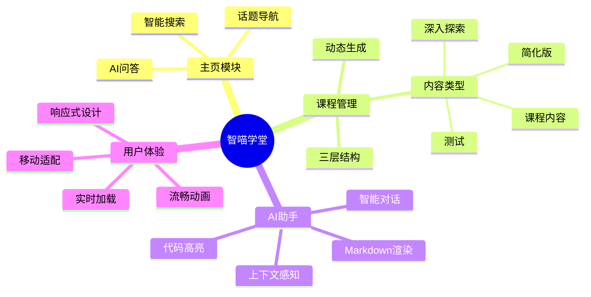
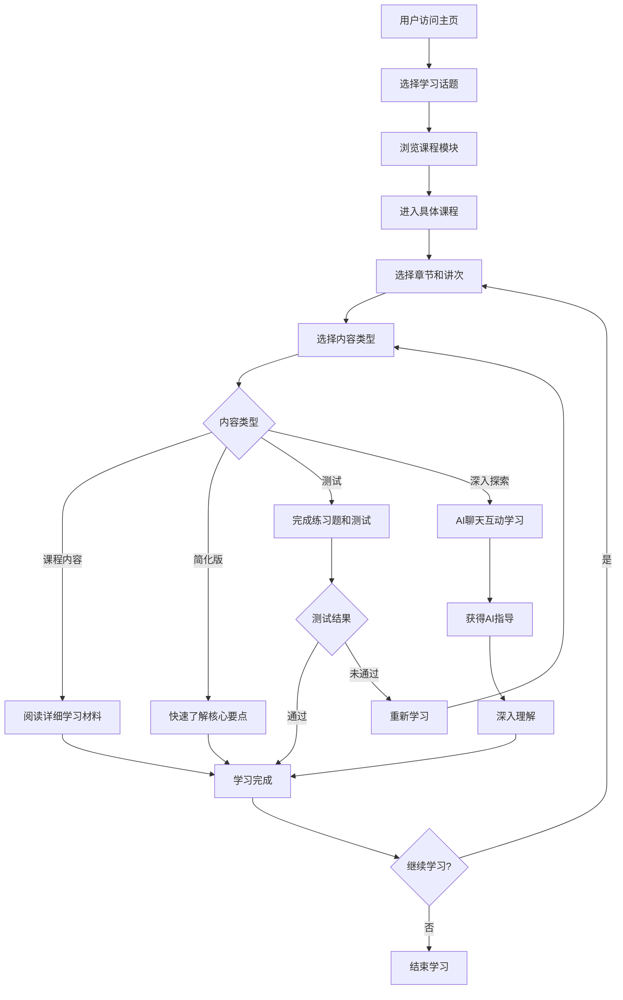
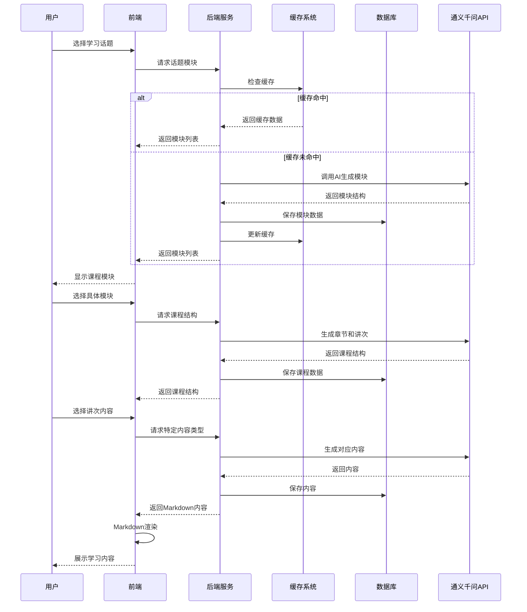
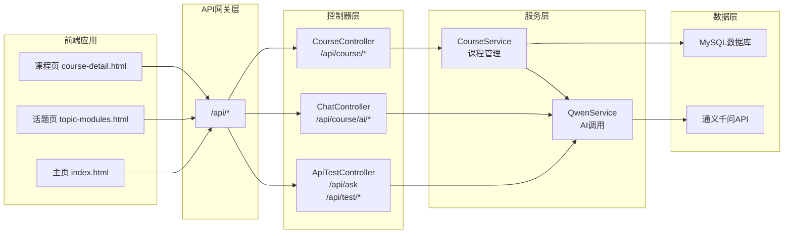
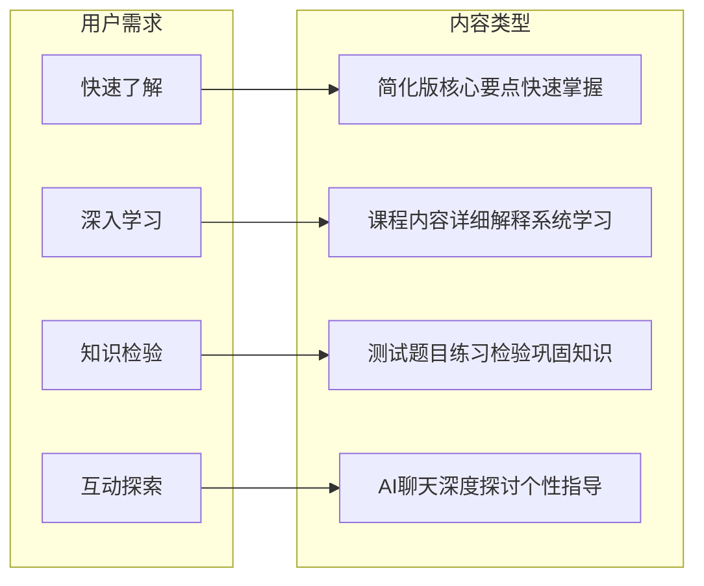
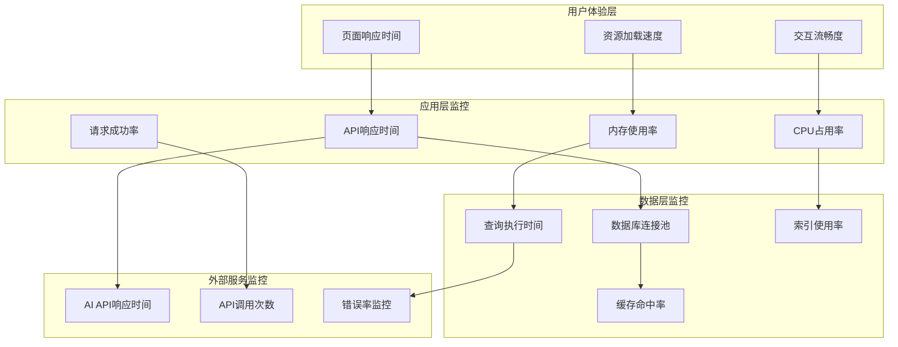
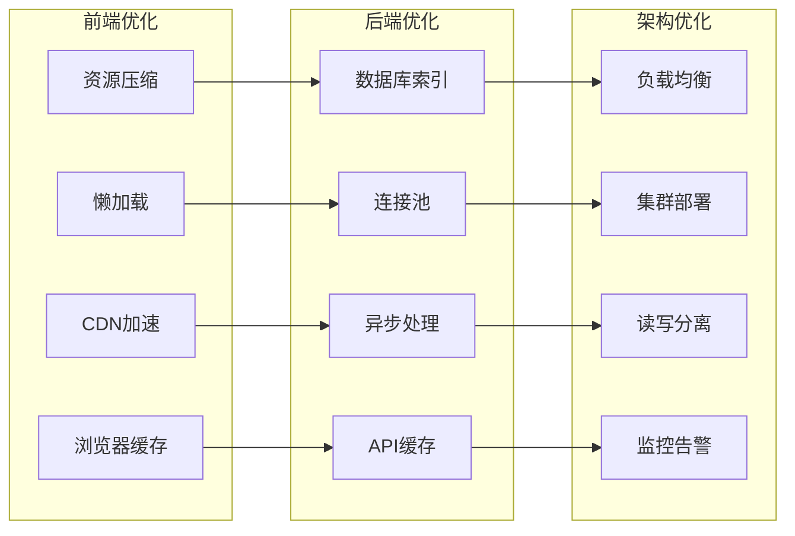

# 智喵学堂（A World of Whys）软件功能说明书

## 1. 系统概述

### 1.1 项目背景
智喵学堂是一个基于Java Spring Boot框架开发的智能学习平台，旨在通过AI技术提供个性化的学习体验。系统集成了通义千问AI模型，实现了智能问答、动态课程生成、个性化学习路径等核心功能。

### 1.2 技术架构
- **后端框架**: Spring Boot 2.7+
- **数据库**: MySQL 8.0
- **前端技术**: HTML5 + CSS3 + JavaScript + Bootstrap 5
- **AI集成**: 阿里云通义千问（Qwen）API
- **构建工具**: Maven
- **设计模式**: MVC、Repository、Service Layer、Factory等

### 1.3 系统特色
- 🤖 **AI驱动**: 集成通义千问，提供智能问答和内容生成
- 📚 **动态课程**: 根据主题自动生成课程结构和内容
- 💬 **交互式学习**: AI聊天助手提供实时学习支持
- 🎯 **个性化**: 多种内容类型满足不同学习需求
- 📱 **响应式**: 支持PC和移动设备访问

### 1.4 系统功能架构图



## 2. 核心功能模块

### 2.1 主页与导航功能

#### 2.1.1 智能搜索系统

**功能描述**: 提供智能化的学习内容搜索功能

**核心特性**:
- 支持自然语言查询
- 实时搜索建议
- 热门话题推荐
- 搜索历史记录

**技术实现**:
```java
// 主要控制器类
@RestController
public class ApiTestController {
    @PostMapping("/api/ask")
    public ResponseEntity<Map<String, Object>> askQuestion(@RequestBody Map<String, String> request)
}
```

**用户界面**:
- 简洁的搜索输入框
- 动态搜索提示
- 分类话题展示

#### 2.1.2 话题导航系统
**功能描述**: 按类别组织学习内容，便于用户浏览

**分类结构**:
- 📊 **数据科学**: 统计学、机器学习、数据分析
- 🔬 **自然科学**: 物理、化学、生物、地理
- 💻 **计算机科学**: 编程、算法、软件工程
- 🏛️ **人文社科**: 历史、哲学、心理学、经济学
- 🎨 **艺术创作**: 文学、音乐、美术、设计
- 🌱 **生活技能**: 健康、理财、沟通、时间管理

### 2.2 课程管理系统

#### 2.2.1 三层架构设计
```
话题 (Topic) → 模块 (Module) → 章节 (Chapter) → 讲次 (Lecture)
```

**数据模型**:
```java
@Entity
public class Topic {
    @Id @GeneratedValue(strategy = GenerationType.IDENTITY)
    private Long id;
    private String name;
    private String description;
    // ... 其他属性
}

@Entity
public class Module {
    @ManyToOne
    private Topic topic;
    private String title;
    private String description;
    // ... 关联关系
}
```

#### 2.2.2 动态内容生成
**功能描述**: 基于AI技术自动生成课程内容

**技术实现**:
```java
@Service
public class CourseService {
    
    @Autowired
    private QwenService qwenService;
    
    // 创建默认课程结构
    private List<Chapter> createDefaultCourseStructure(Module module) {
        String prompt = aiPromptService.buildCourseStructurePrompt(module.getTitle());
        String aiResponse = qwenService.generateContent(prompt);
        // 解析AI响应并创建章节
    }
}
```

**生成内容类型**:
- 📖 **课程内容**: 详细的学习材料
- 📝 **简化版**: 精简的核心要点
- 🧪 **测试**: 练习题和自测内容
- 🔍 **深入探索**: AI交互式学习

### 2.3 智能学习助手

#### 2.3.1 AI聊天功能
**功能描述**: 集成通义千问AI，提供实时智能问答

**核心特性**:
- 上下文感知对话
- 专业学习指导
- 代码示例生成
- 学习路径建议

**技术实现**:
```java
@RestController
@RequestMapping("/api/course")
public class ChatController {
    
    @PostMapping("/ai/chat")
    public ResponseEntity<Map<String, Object>> chat(@RequestBody Map<String, Object> request) {
        String prompt = buildChatPrompt(message, lectureId);
        String aiResponse = qwenService.generateContent(prompt);
        // 返回结构化响应
    }
}
```

#### 2.3.2 Markdown渲染支持
**功能特性**:
- 完整的Markdown语法支持
- 代码高亮显示
- 一键复制代码功能
- 数学公式渲染

**前端实现**:
```javascript
function parseMarkdown(text) {
    // 解析标题、列表、代码块等
    text = text.replace(/^### (.*$)/gm, '<h3>$1</h3>');
    text = text.replace(/^## (.*$)/gm, '<h2>$1</h2>');
    
    // 代码块处理
    text = text.replace(/```(\w+)?\n([\s\S]*?)```/g, function(match, lang, code) {
        return createCodeBlock(code.trim(), lang || 'text');
    });
    
    return text;
}
```

### 2.4 用户界面系统

#### 2.4.1 响应式设计
**技术特性**:
- Bootstrap 5框架
- 移动端适配
- 触摸友好交互
- 流畅动画效果

**CSS架构**:
```css
/* 响应式设计 */
@media (max-width: 768px) {
    .course-header { padding: 1.5rem 0 1rem; }
    .content-type-tabs .nav-link { font-size: 0.9rem; }
}

/* 动画效果 */
@keyframes slideInLeft {
    from { opacity: 0; transform: translateX(-30px); }
    to { opacity: 1; transform: translateX(0); }
}
```

#### 2.4.2 交互式界面元素
**功能组件**:
- 可折叠章节列表
- 标签页式内容切换
- 实时聊天界面
- 进度指示器

### 2.5 数据持久化系统

#### 2.5.1 JPA实体关系
```java
// 一对多关系示例
@Entity
public class Chapter {
    @OneToMany(mappedBy = "chapter", cascade = CascadeType.ALL, fetch = FetchType.LAZY)
    private List<Lecture> lectures = new ArrayList<>();
}

@Entity
public class Lecture {
    @OneToMany(mappedBy = "lecture", cascade = CascadeType.ALL, fetch = FetchType.LAZY)
    private List<LectureContent> contents = new ArrayList<>();
}
```

#### 2.5.2 Repository层设计
```java
@Repository
public interface ChapterRepository extends JpaRepository<Chapter, Long> {
    List<Chapter> findByModuleIdOrderByChapterNumber(Long moduleId);
}

@Repository
public interface LectureContentRepository extends JpaRepository<LectureContent, Long> {
    Optional<LectureContent> findByLectureIdAndContentType(Long lectureId, ContentType contentType);
}
```

## 3. 业务流程说明

### 3.1 用户学习流程



### 3.2 内容生成流程



## 4. API接口说明

### 4.1 API架构图



### 4.2 核心API端点

#### 4.2.1 课程相关接口
```http
GET /api/course/topic-modules?topic={topicName}
功能: 获取指定话题的课程模块列表

GET /api/course/course-structure?moduleId={moduleId}
功能: 获取课程章节结构

GET /api/course/lecture-content?lectureId={lectureId}&type={contentType}
功能: 获取讲次内容
```

#### 4.1.2 AI服务接口
```http
POST /api/course/ai/chat
请求体: {"message": "用户问题", "lectureId": 123}
功能: AI聊天问答

GET /api/course/ai/health
功能: AI服务健康检查
```

#### 4.1.3 测试接口
```http
GET /api/test/status
功能: 检查API状态

POST /api/ask
功能: 智能问答（主页搜索）

GET /api/test/model-info
功能: 获取AI模型信息
```

### 4.2 响应格式

#### 4.2.1 成功响应
```json
{
    "success": true,
    "data": {
        "content": "具体内容",
        "timestamp": 1703123456789
    }
}
```

#### 4.2.2 错误响应
```json
{
    "success": false,
    "error": "错误描述",
    "code": "ERROR_CODE",
    "timestamp": 1703123456789
}
```

## 5. 用户操作指南

### 5.1 基本操作流程

#### 5.1.1 开始学习
1. **访问主页**: 浏览器打开 `http://localhost:3000`
2. **选择话题**: 点击感兴趣的学习领域
3. **浏览模块**: 查看话题下的各个学习模块
4. **进入课程**: 点击具体模块开始学习

#### 5.1.2 课程学习
1. **章节导航**: 左侧边栏显示完整课程结构
2. **选择讲次**: 点击具体讲次开始学习
3. **切换内容**: 使用顶部标签切换不同类型内容
4. **AI助手**: 在"深入探索"标签中与AI互动

### 5.2 高级功能使用

#### 5.2.1 AI聊天助手
**使用步骤**:
1. 选择任意讲次内容
2. 点击"深入探索"标签
3. 在聊天框输入问题
4. 获得AI实时回答和指导

**功能特色**:
- 支持Markdown格式回答
- 代码示例一键复制
- 上下文感知对话
- 学习建议和拓展

#### 5.2.2 内容个性化

**学习模式对比图**:



**多种学习模式**:
- **详细模式**: 完整的课程内容和解释
- **简化模式**: 核心要点和概念总结  
- **测试模式**: 练习题和知识检验
- **探索模式**: AI互动式深度学习

## 6. 系统性能与优化

### 6.1 性能监控架构



### 6.2 性能特性
- **响应时间**: API调用 < 2秒
- **并发支持**: 支持100+并发用户
- **数据缓存**: 智能缓存减少AI调用
- **渐进加载**: 按需加载课程内容

### 6.3 优化策略



**具体策略**:
- **数据库索引**: 优化查询性能
- **连接池**: 数据库连接复用
- **异步处理**: 非阻塞AI服务调用
- **前端优化**: 资源压缩和缓存

## 7. 扩展功能规划

### 7.1 已规划功能
- 用户注册和登录系统
- 学习进度跟踪
- 个人学习笔记
- 社区讨论功能
- 学习报告生成

### 7.2 技术增强
- 更多AI模型集成
- 语音交互支持
- 移动应用开发
- 离线学习功能

---

**版本信息**: v1.0.0  
**更新日期**: 2024年6月  
**开发团队**: 智喵学堂开发组