# 智喵学堂（A World of Whys）软件设计文档

## 1. 项目概述

### 1.1 项目背景
智喵学堂是一个基于Java Spring Boot框架开发的智能学习平台，采用前后端分离架构，集成AI技术提供个性化学习体验。本文档详细描述了系统的架构设计、核心类设计以及使用的设计模式。

### 1.2 技术栈
- **后端**: Java 17, Spring Boot 2.7+, Spring Data JPA, MySQL
- **前端**: HTML5, CSS3, JavaScript ES6, Bootstrap 5
- **AI集成**: 阿里云通义千问 API
- **构建工具**: Maven 3.6+
- **开发环境**: IntelliJ IDEA, Git

## 2. 系统架构设计

### 2.1 总体架构图

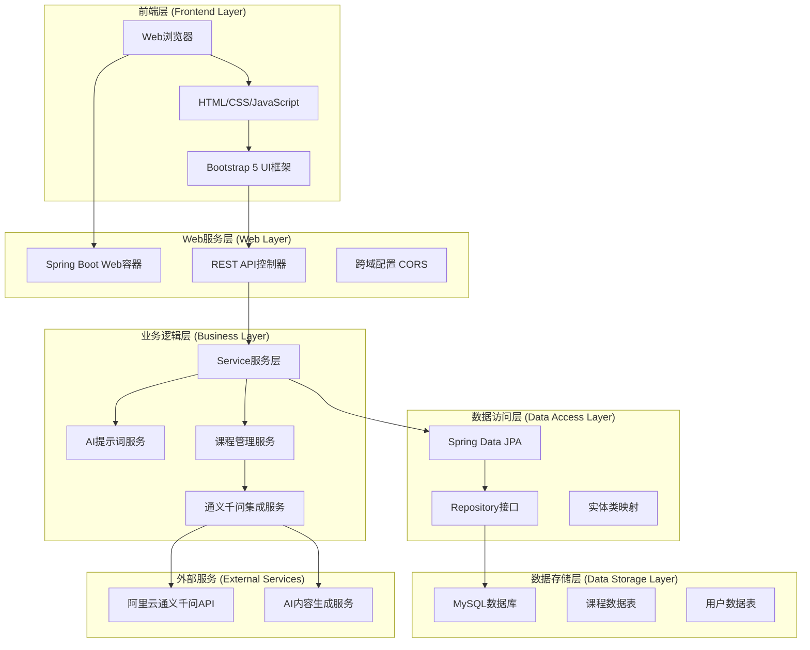

### 2.2 MVC架构详解

#### 2.2.1 Model层（模型层）
负责数据定义和业务逻辑处理
```java
// 核心实体类
@Entity
public class Topic {          // 学习话题
    @Id @GeneratedValue
    private Long id;
    private String name;
    @OneToMany(mappedBy = "topic")
    private List<Module> modules;
}

@Entity  
public class Module {         // 课程模块
    @ManyToOne
    private Topic topic;
    @OneToMany(mappedBy = "module")
    private List<Chapter> chapters;
}

@Entity
public class Chapter {        // 章节
    @ManyToOne
    private Module module;
    @OneToMany(mappedBy = "chapter")
    private List<Lecture> lectures;
}
```

#### 2.2.2 View层（视图层）  
前端页面和用户界面
- `index.html` - 主页搜索界面
- `topic-modules.html` - 话题模块展示
- `course-detail.html` - 课程详情和学习界面

#### 2.2.3 Controller层（控制器层）
处理HTTP请求和响应
```java
@RestController
@RequestMapping("/api/course")
public class CourseController {
    
    @GetMapping("/topic-modules")
    public ResponseEntity<List<Module>> getTopicModules(@RequestParam String topic)
    
    @GetMapping("/course-structure") 
    public ResponseEntity<List<Chapter>> getCourseStructure(@RequestParam Long moduleId)
    
    @GetMapping("/lecture-content")
    public ResponseEntity<String> getLectureContent(@RequestParam Long lectureId, @RequestParam ContentType type)
}
```

### 2.3 分层架构设计

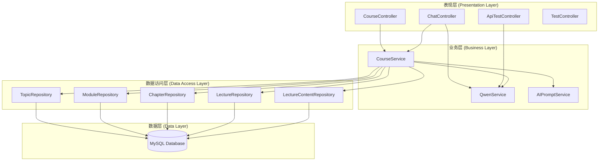

## 3. 核心类设计

### 3.1 实体类层次结构

#### 3.1.1 主要实体类图
```mermaid
classDiagram
    class Topic {
        -Long id
        -String name
        -String description
        -List~Module~ modules
        +getId()
        +getName()
        +getModules()
    }
    
    class Module {
        -Long id
        -String title
        -String description
        -Topic topic
        -List~Chapter~ chapters
        +getTitle()
        +getChapters()
    }
    
    class Chapter {
        -Long id
        -String title
        -Integer chapterNumber
        -Module module
        -List~Lecture~ lectures
        +getTitle()
        +getLectures()
    }
    
    class Lecture {
        -Long id
        -String title
        -Integer lectureNumber
        -Chapter chapter
        -List~LectureContent~ contents
        +getTitle()
        +getContents()
    }
    
    class LectureContent {
        -Long id
        -String content
        -ContentType contentType
        -Lecture lecture
        +getContent()
        +getContentType()
    }
    
    class ContentType {
        <<enumeration>>
        COURSE
        SIMPLIFIED
        TEST
        ADVANCED
    }
    
    Topic ||--o{ Module : contains
    Module ||--o{ Chapter : contains
    Chapter ||--o{ Lecture : contains
    Lecture ||--o{ LectureContent : contains
    LectureContent --> ContentType : uses
```

#### 3.1.2 实体类详细设计

**Topic类**:
```java
@Entity
@Table(name = "topics")
public class Topic {
    @Id
    @GeneratedValue(strategy = GenerationType.IDENTITY)
    private Long id;
    
    @Column(nullable = false, unique = true)
    private String name;
    
    @Column(columnDefinition = "TEXT")
    private String description;
    
    @OneToMany(mappedBy = "topic", cascade = CascadeType.ALL, fetch = FetchType.LAZY)
    private List<Module> modules = new ArrayList<>();
    
    // 构造函数、getter、setter方法
}
```

**ContentType枚举**:
```java
public enum ContentType {
    COURSE("课程内容"),      // 详细的学习内容
    SIMPLIFIED("简化版"),    // 精简的核心要点
    TEST("测试"),           // 练习题和测试
    ADVANCED("深入探索");   // AI交互式学习

    private final String displayName;
    
    ContentType(String displayName) {
        this.displayName = displayName;
    }
    
    public String getDisplayName() {
        return displayName;
    }
}
```

### 3.2 服务层类设计

#### 3.2.1 CourseService类图
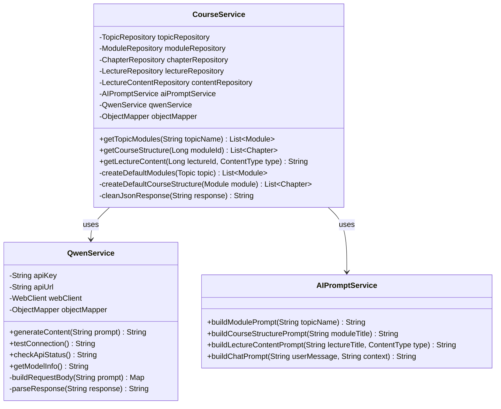

#### 3.2.2 核心业务方法

**课程结构生成**:
```java
@Service
@Transactional
public class CourseService {
    
    // 创建默认课程结构
    private List<Chapter> createDefaultCourseStructure(Module module) {
        try {
            // 构建AI提示词
            String prompt = aiPromptService.buildCourseStructurePrompt(module.getTitle());
            
            // 调用AI生成内容
            String aiResponse = qwenService.generateContent(prompt);
            String cleanResponse = cleanJsonResponse(aiResponse);
            
            // 解析JSON响应
            ObjectNode responseNode = (ObjectNode) objectMapper.readTree(cleanResponse);
            ArrayNode chaptersArray = (ArrayNode) responseNode.get("chapters");
            
            List<Chapter> chapters = new ArrayList<>();
            for (int i = 0; i < chaptersArray.size(); i++) {
                JsonNode chapterNode = chaptersArray.get(i);
                
                // 创建章节
                Chapter chapter = new Chapter();
                chapter.setTitle(chapterNode.get("title").asText());
                chapter.setChapterNumber(i + 1);
                chapter.setModule(module);
                
                // 保存章节
                chapter = chapterRepository.save(chapter);
                
                // 创建讲次
                ArrayNode lecturesArray = (ArrayNode) chapterNode.get("lectures");
                List<Lecture> lectures = new ArrayList<>();
                
                for (int j = 0; j < lecturesArray.size(); j++) {
                    Lecture lecture = new Lecture();
                    lecture.setTitle(lecturesArray.get(j).asText());
                    lecture.setLectureNumber(j + 1);
                    lecture.setChapter(chapter);
                    lectures.add(lectureRepository.save(lecture));
                }
                
                chapter.setLectures(lectures);
                chapters.add(chapter);
            }
            
            return chapters;
            
        } catch (Exception e) {
            System.err.println("创建课程结构失败: " + e.getMessage());
            return createFallbackCourseStructure(module);
        }
    }
}
```

### 3.3 控制器层设计

#### 3.3.1 REST API控制器架构
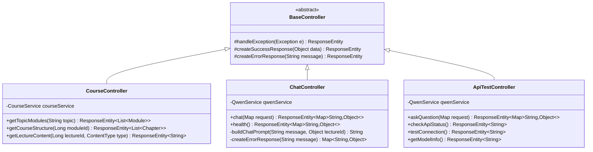

## 4. 设计模式应用

### 4.1 设计模式概览图

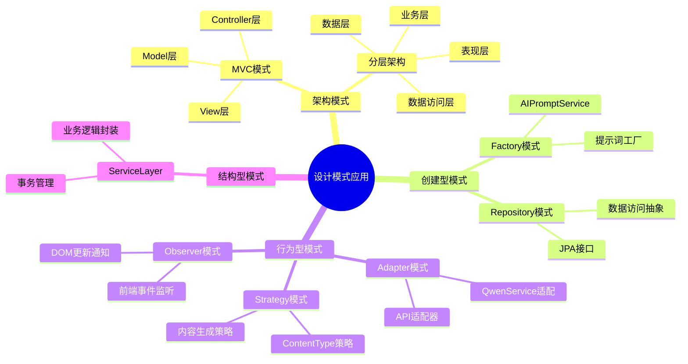

### 4.2 MVC模式（Model-View-Controller）

**应用场景**: 整体架构设计  
**实现说明**: 
- **Model**: 实体类和业务逻辑（Topic, Module, Chapter等）
- **View**: 前端HTML页面和JavaScript
- **Controller**: Spring Boot控制器类

**优势**:
- 分离关注点，降低耦合
- 便于维护和扩展
- 支持多视图展示同一数据

```java
// Controller层
@RestController
public class CourseController {
    @Autowired
    private CourseService courseService; // 调用业务层
    
    @GetMapping("/api/course/modules")
    public ResponseEntity<List<Module>> getModules() {
        return ResponseEntity.ok(courseService.getModules()); // 返回Model数据给View
    }
}
```

### 4.2 Repository模式

**应用场景**: 数据访问层设计  
**实现说明**: 使用Spring Data JPA的Repository接口

```java
@Repository
public interface TopicRepository extends JpaRepository<Topic, Long> {
    Optional<Topic> findByName(String name);
    List<Topic> findByNameContainingIgnoreCase(String keyword);
}

@Repository
public interface ModuleRepository extends JpaRepository<Module, Long> {
    List<Module> findByTopicIdOrderByIdAsc(Long topicId);
}
```

**优势**:
- 封装数据访问逻辑
- 提供统一的数据操作接口
- 支持自动查询方法生成

### 4.3 Service Layer模式（服务层模式）

**应用场景**: 业务逻辑封装  
**实现说明**: 将业务操作封装在Service类中

```java
@Service
@Transactional
public class CourseService {
    
    @Autowired
    private TopicRepository topicRepository;
    
    @Autowired 
    private QwenService qwenService;
    
    public List<Module> getTopicModules(String topicName) throws Exception {
        // 业务逻辑：检查缓存、调用AI、保存数据等
        Topic topic = topicRepository.findByName(topicName)
            .orElseGet(() -> createTopicWithModules(topicName));
        return topic.getModules();
    }
}
```

**优势**:
- 封装复杂业务逻辑
- 支持事务管理
- 便于单元测试

### 4.4 Factory模式

**应用场景**: AI提示词构建  
**实现说明**: AIPromptService充当工厂角色

#### 4.4.1 Factory模式结构图

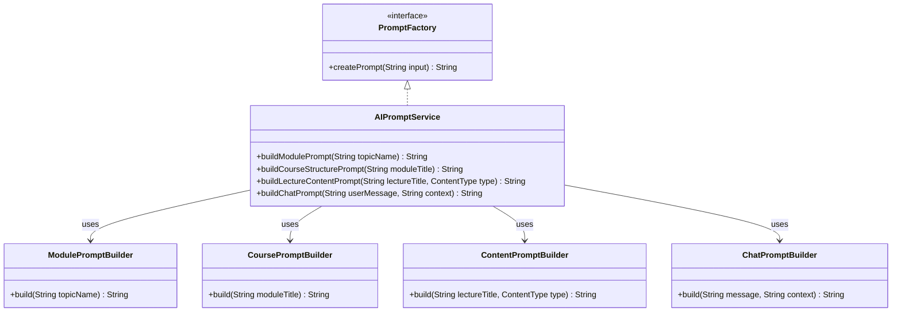

```java
@Service
public class AIPromptService {
    
    public String buildModulePrompt(String topicName) {
        return "请为主题'" + topicName + "'生成5个学习模块...";
    }
    
    public String buildCourseStructurePrompt(String moduleTitle) {
        return "请为模块'" + moduleTitle + "'生成详细的课程结构...";
    }
    
    public String buildLectureContentPrompt(String lectureTitle, ContentType type) {
        switch (type) {
            case COURSE:
                return "请为讲次'" + lectureTitle + "'生成详细的课程内容...";
            case SIMPLIFIED:
                return "请为讲次'" + lectureTitle + "'生成简化版要点...";
            case TEST:
                return "请为讲次'" + lectureTitle + "'生成测试题目...";
            default:
                return "请为讲次'" + lectureTitle + "'生成学习内容...";
        }
    }
}
```

**优势**:
- 集中管理对象创建逻辑
- 便于维护和修改
- 支持不同类型的提示词生成

### 4.5 Strategy模式（策略模式）

**应用场景**: 内容类型处理  
**实现说明**: ContentType枚举结合不同的内容生成策略

#### 4.5.1 Strategy模式流程图

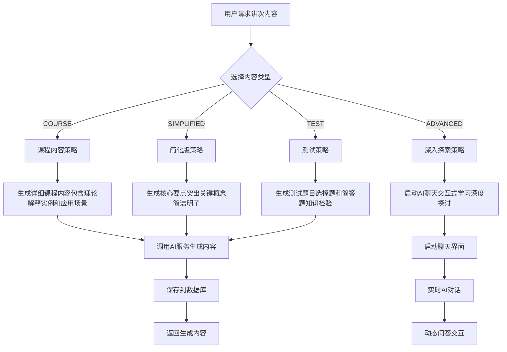

#### 4.5.2 策略类图

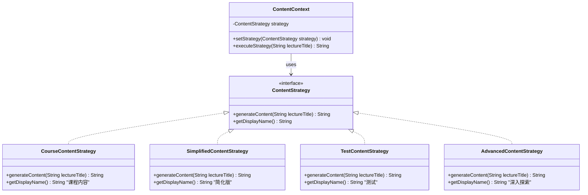

```java
public enum ContentType {
    COURSE("课程内容") {
        @Override
        public String generatePrompt(String lectureTitle) {
            return "请为讲次'" + lectureTitle + "'生成详细的课程内容，包括理论解释、实例和应用场景。";
        }
    },
    
    SIMPLIFIED("简化版") {
        @Override
        public String generatePrompt(String lectureTitle) {
            return "请为讲次'" + lectureTitle + "'生成简化版内容，突出核心要点。";
        }
    },
    
    TEST("测试") {
        @Override
        public String generatePrompt(String lectureTitle) {
            return "请为讲次'" + lectureTitle + "'生成测试题目，包括选择题和简答题。";
        }
    };
    
    // 抽象方法，子类实现不同策略
    public abstract String generatePrompt(String lectureTitle);
}
```

### 4.6 Observer模式（观察者模式）

**应用场景**: 前端事件处理  
**实现说明**: JavaScript事件监听和DOM更新

```javascript
// 观察者模式在前端的应用
class CourseDetailPage {
    constructor() {
        this.currentLectureId = null;
        this.observers = [];
    }
    
    // 添加观察者
    addObserver(observer) {
        this.observers.push(observer);
    }
    
    // 通知所有观察者
    notifyObservers(event, data) {
        this.observers.forEach(observer => {
            if (observer[event]) {
                observer[event](data);
            }
        });
    }
    
    // 选择讲次时通知观察者
    selectLecture(lectureId, lectureTitle) {
        this.currentLectureId = lectureId;
        this.notifyObservers('onLectureChanged', {
            lectureId,
            lectureTitle
        });
    }
}
```

### 4.7 Adapter模式（适配器模式）

**应用场景**: AI服务接口适配  
**实现说明**: QwenService适配通义千问API

```java
@Service
public class QwenService {
    
    // 适配器方法：将内部接口适配为外部API调用
    public String generateContent(String prompt) {
        try {
            // 构建外部API需要的请求格式
            Map<String, Object> requestBody = buildRequestBody(prompt);
            
            // 调用外部API
            String response = webClient.post()
                .uri(apiUrl)
                .header("Authorization", "Bearer " + apiKey)
                .bodyValue(requestBody)
                .retrieve()
                .bodyToMono(String.class)
                .block();
            
            // 解析外部API响应为内部需要的格式
            return parseResponse(response);
            
        } catch (Exception e) {
            return "API调用失败: " + e.getMessage();
        }
    }
    
    // 适配请求格式
    private Map<String, Object> buildRequestBody(String prompt) {
        Map<String, Object> requestBody = new HashMap<>();
        requestBody.put("model", "qwen-max");
        
        List<Map<String, String>> messages = new ArrayList<>();
        Map<String, String> userMessage = new HashMap<>();
        userMessage.put("role", "user");
        userMessage.put("content", prompt);
        messages.add(userMessage);
        
        requestBody.put("messages", messages);
        return requestBody;
    }
}
```

## 5. 数据库设计

### 5.1 ER图

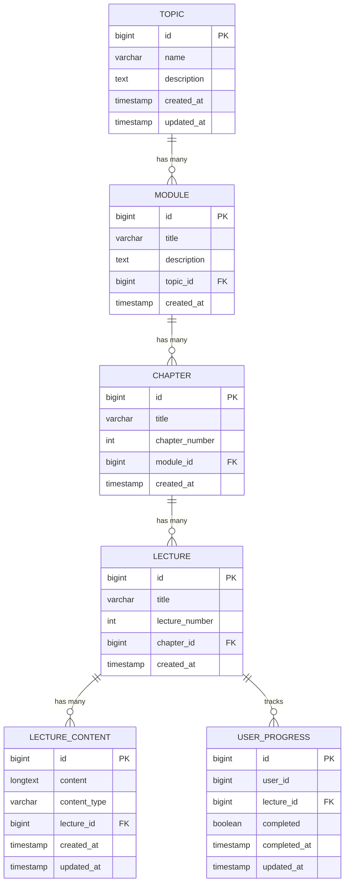

### 5.2 表结构设计

#### 5.2.1 核心表结构
```sql
-- 话题表
CREATE TABLE topics (
    id BIGINT AUTO_INCREMENT PRIMARY KEY,
    name VARCHAR(255) NOT NULL UNIQUE,
    description TEXT,
    created_at TIMESTAMP DEFAULT CURRENT_TIMESTAMP,
    updated_at TIMESTAMP DEFAULT CURRENT_TIMESTAMP ON UPDATE CURRENT_TIMESTAMP
);

-- 模块表
CREATE TABLE modules (
    id BIGINT AUTO_INCREMENT PRIMARY KEY,
    title VARCHAR(255) NOT NULL,
    description TEXT,
    topic_id BIGINT NOT NULL,
    created_at TIMESTAMP DEFAULT CURRENT_TIMESTAMP,
    FOREIGN KEY (topic_id) REFERENCES topics(id) ON DELETE CASCADE
);

-- 章节表
CREATE TABLE chapters (
    id BIGINT AUTO_INCREMENT PRIMARY KEY,
    title VARCHAR(255) NOT NULL,
    chapter_number INT NOT NULL,
    module_id BIGINT NOT NULL,
    created_at TIMESTAMP DEFAULT CURRENT_TIMESTAMP,
    FOREIGN KEY (module_id) REFERENCES modules(id) ON DELETE CASCADE
);

-- 讲次表
CREATE TABLE lectures (
    id BIGINT AUTO_INCREMENT PRIMARY KEY,
    title VARCHAR(255) NOT NULL,
    lecture_number INT NOT NULL,
    chapter_id BIGINT NOT NULL,
    created_at TIMESTAMP DEFAULT CURRENT_TIMESTAMP,
    FOREIGN KEY (chapter_id) REFERENCES chapters(id) ON DELETE CASCADE
);

-- 讲次内容表
CREATE TABLE lecture_contents (
    id BIGINT AUTO_INCREMENT PRIMARY KEY,
    content LONGTEXT,
    content_type VARCHAR(50) NOT NULL,
    lecture_id BIGINT NOT NULL,
    created_at TIMESTAMP DEFAULT CURRENT_TIMESTAMP,
    updated_at TIMESTAMP DEFAULT CURRENT_TIMESTAMP ON UPDATE CURRENT_TIMESTAMP,
    FOREIGN KEY (lecture_id) REFERENCES lectures(id) ON DELETE CASCADE,
    UNIQUE KEY unique_lecture_content (lecture_id, content_type)
);
```

### 5.3 索引设计
```sql
-- 性能优化索引
CREATE INDEX idx_modules_topic_id ON modules(topic_id);
CREATE INDEX idx_chapters_module_id ON chapters(module_id);
CREATE INDEX idx_lectures_chapter_id ON lectures(chapter_id);
CREATE INDEX idx_lecture_contents_lecture_id ON lecture_contents(lecture_id);
CREATE INDEX idx_lecture_contents_type ON lecture_contents(content_type);

-- 复合索引
CREATE INDEX idx_chapters_module_number ON chapters(module_id, chapter_number);
CREATE INDEX idx_lectures_chapter_number ON lectures(chapter_id, lecture_number);
```

## 6. 前端架构设计

### 6.1 前端组件结构

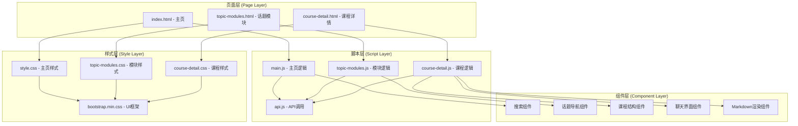

### 6.2 前端交互流程图

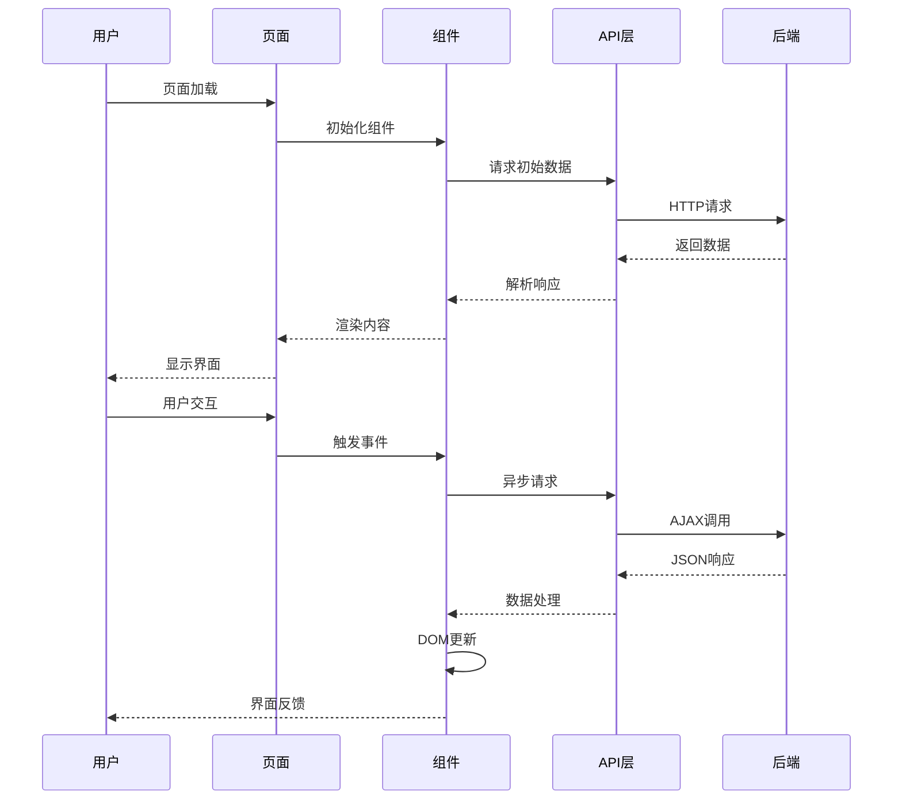

### 6.3 JavaScript模块设计

#### 6.3.1 主要JavaScript类
```javascript
// 主页应用类
class WhysApp {
    constructor() {
        this.apiService = new ApiService();
    }
    
    async handleSearch(query) {
        // 处理搜索逻辑
    }
    
    displayAnswer(data, question) {
        // 显示AI回答
    }
    
    parseMarkdown(text) {
        // Markdown解析
    }
}

// API服务类
class ApiService {
    constructor() {
        this.baseURL = 'http://localhost:8080';
    }
    
    async request(endpoint, options = {}) {
        // 统一API请求方法
    }
    
    async askQuestion(question) {
        // 问答API调用
    }
}
```

#### 6.2.2 模块化设计
```javascript
// 课程详情页面模块
const CourseDetailModule = {
    // 状态管理
    state: {
        currentModuleId: null,
        currentLectureId: null,
        chapters: []
    },
    
    // 初始化
    init() {
        this.bindEvents();
        this.loadCourseStructure();
    },
    
    // 事件绑定
    bindEvents() {
        this.bindContentTypeEvents();
        this.bindNavigationEvents();
    },
    
    // 课程加载
    async loadCourseStructure() {
        // 加载课程结构逻辑
    }
};
```

## 7. 安全性设计

### 7.1 数据安全
- **SQL注入防护**: 使用JPA参数化查询
- **XSS防护**: 前端输入验证和HTML转义
- **CSRF防护**: Spring Security CSRF Token

### 7.2 API安全
```java
@Configuration
public class CorsConfig {
    @Bean
    public CorsFilter corsFilter() {
        CorsConfiguration config = new CorsConfiguration();
        config.setAllowCredentials(true);
        config.addAllowedOriginPattern("*");
        config.addAllowedHeader("*");
        config.addAllowedMethod("*");
        
        UrlBasedCorsConfigurationSource source = new UrlBasedCorsConfigurationSource();
        source.registerCorsConfiguration("/**", config);
        
        return new CorsFilter(source);
    }
}
```

### 7.3 敏感信息保护
```properties
# 配置文件中的敏感信息
qwen.api.key=${QWEN_API_KEY:your_api_key}
spring.datasource.password=${DB_PASSWORD:your_password}
```

## 8. 性能优化设计

### 8.1 数据库优化
- **连接池配置**: HikariCP连接池
- **查询优化**: JPA查询优化和索引设计
- **缓存策略**: Spring Cache注解

```java
@Service
public class CourseService {
    
    @Cacheable(value = "courseStructure", key = "#moduleId")
    public List<Chapter> getCourseStructure(Long moduleId) {
        // 缓存课程结构数据
    }
    
    @CacheEvict(value = "courseStructure", key = "#moduleId")
    public void clearCourseCache(Long moduleId) {
        // 清除缓存
    }
}
```

### 8.2 前端性能优化
- **资源压缩**: CSS/JS文件压缩
- **懒加载**: 图片和内容按需加载
- **缓存策略**: 浏览器缓存配置

## 9. 测试策略

### 9.1 单元测试
```java
@SpringBootTest
class CourseServiceTest {
    
    @Autowired
    private CourseService courseService;
    
    @Test
    void testGetTopicModules() {
        // 测试获取话题模块
        List<Module> modules = courseService.getTopicModules("计算机科学");
        assertThat(modules).isNotEmpty();
    }
}
```

### 9.2 集成测试
```java
@SpringBootTest(webEnvironment = SpringBootTest.WebEnvironment.RANDOM_PORT)
@AutoConfigureTestDatabase(replace = AutoConfigureTestDatabase.Replace.NONE)
class CourseControllerIntegrationTest {
    
    @Autowired
    private TestRestTemplate restTemplate;
    
    @Test
    void testGetCourseStructure() {
        // 测试API接口
    }
}
```

## 10. 部署架构

### 10.1 开发环境
- **本地开发**: Spring Boot内嵌Tomcat + MySQL
- **前端服务**: Python HTTP Server 或 Node.js

### 10.2 生产环境
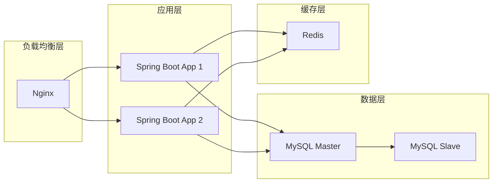

---

**文档版本**: v1.0.0  
**最后更新**: 2024年6月  
**设计团队**: 智喵学堂开发组